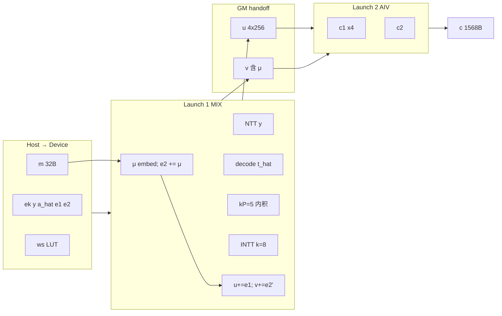

# INTEGRATION_PLAN — pass-fix-f203-alg14-lines2-24-encrypt-compute-tail-k4

**定位**：T17 **PASS** — Alg.14 行 2/16–24（prep 外）→ **c = c₁‖c₂**；SIM **1 launch** 内联 pack；**全链 Encrypt 基线**。

**符号**：FIPS 203 Alg.14（ml_kem_1024 / k=4）。

---

## 1. 边界与分期

### 1.1 本目录覆盖

| FIPS 行 | 数学 | 来源探针 |
|---------|------|----------|
| **2** | t̂ ← ByteDecode₁₂(ek) | compute |
| **16–17** | ŷ ← NTT(y) | compute |
| **18** | û, tr̂ ← (Âᵀ\|t̂ᵀ) ∘ ŷ | compute（kP=5） |
| **19** | u ← INTT(û) + e₁ | compute |
| **20–21** | μ ← EmbedMessage(m)；v ← INTT(tr̂) + **e₂'** + … | compute 内 **e₂' = e₂ + μ (mod q)**，再 `v ← INTT(tr̂) + e₂'` |
| **22–23** | c₁ ← ByteEncode₁₁(Compress₁₁(u)) | tail（**纯 pack**） |
| **24** | c₂ ← ByteEncode₅(Compress₅(v)) | tail（v 已含 μ，**不再** tail 内加 μ） |

### 1.2 本阶段不做

| 项 | 说明 |
|----|------|
| prep（行 3–15）单独 launch | 全链目标 **2 launch**（prep∥compute 同 Launch 1 + tail Launch 2），**非** prep/compute/tail 三分 |
| 为 μ 单独 +1 launch | μ 折叠进 Launch 1 开头 `e₂ += μ`，见 §4.3 |
| 单 launch 融合 MIX+tail | 可选远期；先 2 launch GM 验收 `c` |
| correctness 全链 tick 对比 | 仅验 `c` I/O |
| 从 `frozen-fix-f203-alg14-encrypt-2launch-k4` 抄码 | 只读判决书 |

### 1.3 代码来源

| 允许 | 禁止 |
|------|------|
| **抄码** vendoring 自两上游探针 `compute/` | 运行时 `#include` 其它探针路径 |
| `f203_encrypt_compute_tail_layout.h` 本目录 GM 契约 | 从 `fix-f203-alg14-pke-encrypt-correctness-k4` 整树 fork |
| `library/shared/`、`scripts/` CANN 壳 | `ascendc-tests/frozen/` 带出 |

---

## 2. 上游探针要点（拼接必须尊重）

### 2.1 compute — 分核、调度、存储

**Kernel**：`f203_encrypt_l18_l19`（**SIM 生产路径**）

| 属性 | 值 |
|------|-----|
| 核型 | `KERNEL_TYPE_MIX_AIC_1_2`，`blockDim=1` |
| AIV | 2×subBlock（halfrows 内积 + INTT S1/S3 分片） |
| AIC | Stage2 MMAD（NTT k=4 + INTT k=8 串行复用 **同一 ws**） |

**FSM 顺序**（CrossCore **仅 AIC↔AIV**）：

```text
NTT(y):     AIV_SPLIT → AIC_MMAD → AIV_PACK → y_hat GM
行 2:       AIV0 ByteDecode₁₂(ek) → t_hat UB
行 18:      kP=5 内积 → uTr pad→8 **驻留 UB**
            AIV0: [û0, û1, tr̂, 0]
            AIV1: [û2, û3, 0, 0]
GATE:       ST_IP_AIV_DONE → ST_AT_JP_GATE（释放 INTT MMAD）
行 19/21:   INTT k=8 batch → u[0..3]+e₁ / v(tr̂ 行)+e₂
```

**存储红线**（[`F203-Encrypt-compute-行18-19-UB驻留技术总结.md`](../../docs/notes/F203-Encrypt-compute-行18-19-UB驻留技术总结.md)）：

- INTT Stage1 输入必须来自内积 **当次 UB**（`ProcessFromLocal`），禁止「标量写 GM → MTE 再读」。
- `ws` 按 INTT k=8 分配（`wssize`）；NTT 段仅用前 8 行 S0，余行 zero。
- **handoff 输出**：`uOut` int32[4,256] 行主序、`vOut` int32[256]（**已含 e₂+μ**，见 §4.3）。

**Host 分叉**：

| 平台 | Launch | 说明 |
|------|--------|------|
| **SIM** | 1× `f203_encrypt_l18_l19` | `RunSimFusedSingleLaunch` |
| **CPU** | 3×（ntt_y → at_jp → intt_e1） | tikicpu MIX 死锁 → **不得**调融合核；**无设备 v** |

→ **Phase A 验收以 SIM 为主**；CPU 可仅验 tail 段或 host 注入 v golden（见 §6）。

### 2.2 tail — 分核、调度、存储（拼接后瘦身）

**Kernel**：`f203_encrypt_alg14_tail`（本目录 vendoring 后 **去掉重复 μ_embed**）

| 属性 | 值 |
|------|-----|
| 核型 | `KERNEL_TYPE_AIV_ONLY`，`blockDim=1` |
| 顺序 | 4×(Compress₁₁+ByteEncode₁₁) → Compress₅+ByteEncode₅ |
| UB | 同上游 tail（无 m 队列时可省 `queM`） |

**输入契约**（handoff）：

| GM | 形状 | 说明 |
|----|------|------|
| `uGm` | int32[4,256] | Launch 1 `uOut` |
| `vGm` | int32[256] | Launch 1 `vOut`（**已** INTT(tr̂)+e₂+μ） |

**行 20/21 不在 tail 重复**：μ 已在 Launch 1 写入 `e₂`；tail **只负责 pack**。

### 2.3 tail pack 设备实现与上游探针宏策略

**抄码来源**（vendoring 至 `compute/f203_tail_compress_byteencode.hpp`、`f203_encrypt_alg14_pack.cpp`）：

| Alg.14 行 | 算子 | 上游探针 | tail 采用路径 | 宏开关（探针内） |
|-----------|------|----------|---------------|------------------|
| 22–23 | Compress₁₁ + ByteEncode₁₁ | `pass-f203-compress-d-vec-k4` + `pass-f203-byteencode-d-vec-k4` | **向量 Compress** + **标量逐组 ByteEncode** | `COMPRESS_D_VEC=1`（默认，激活）；`BYTE_ENCODE_D_VEC=1`（默认，mask+标量 pack） |
| 24 | Compress₅ + ByteEncode₅ | 同上 d=5 | 同上 | 同上 |

**ByteEncode 不激活 `BYTE_ENCODE_D_VEC=2`**：该档为 2026-07-08 在 byteencode 探针内完成的真·向量 pack（Gather+向量 byte-lane）实验；CPU/SIM 0-diff 但 SIM tick **慢于**标量逐组（d=5 +7%、d=11 +12%）。代码**保留**于探针供对照，**tail 与默认验收均用 VEC=1**。

**原因摘要**：d=5/d=11 每系数 5/11 bit 跨字节边界不规则，拼字无法像 d=12（2×12bit=3B）整字搬出；Gather×8 开销大于标量逐组收益。Compress 无此问题（纯 per-lane 算术）。

**Decrypt 对称链**（Phase A tail 不含，Decrypt 全链时用）：

| 算子 | 探针 | 实现与宏 |
|------|------|----------|
| ByteDecode_d | `pass-f203-alg6-bytedecode-d-vec-k4` | d=4：`BYTE_DECODE_D_VEC=1` 向量 nibble mask + 标量 scatter；d=5/10/11：**仅标量逐组 unpack**（`VEC=0` 与 `VEC=1` 同体，无 encode 式 VEC=2） |
| Decompress_d | `pass-f203-decompress-d-vec-k4` | **默认向量** `DECOMPRESS_D_VEC=1`（`Muls(q)+Adds(bias)+ShiftRight(d)`，全档 per-lane）；`VEC=0` 标量 fallback |

详见各探针 `STATUS.md`、定稿 [`docs/notes/F203-ByteEncode-ByteDecode-d-向量与标量选型.md`](../../docs/notes/F203-ByteEncode-ByteDecode-d-向量与标量选型.md) 与 qa/2026-07-08 §2c。

---

## 3. 目标 Launch 拓扑（Phase C = SIM 1 launch）

```text
┌─ 单 ACL session / 单 stream ─────────────────────────────────────────┐
│ Host H2D：m, ek, y, a_hat, e1, e2, ws, tiling                          │
│                                                                      │
│ Launch 1  f203_encrypt_l18_l19   MIX  blockDim=1                     │
│   [AIV0 前缀] μ←m；e₂ GM += μ                                          │
│   … NTT → 内积 → INTT → u+=e₁；v ← INTT(tr̂)+e₂'                      │
│   [AIV 分片] 行 22–24 内联 pack → c（sub0: c₁[0..1]+c₂；sub1: c₁[2..3]）│
│   aclrtSynchronizeStream                                               │
│ Host D2H：c.bin, u.bin, v.bin                                         │
└──────────────────────────────────────────────────────────────────────┘
```

**CPU** 仍用三 launch compute + 独立 `f203_encrypt_alg14_pack`（tikicpu 不跑融合核）。

**func_key**：SIM **1** 个 device 核（pack 内联，不再注册独立 pack 核亦可保留 pack 供 CPU 链接）。

**Phase A→C**：原 2 launch GM 直连已验收；Phase C 去掉 pack 二次 launch，双 AIV 并行 pack。

---

## 4. 统一 GM 布局与 handoff

### 4.1 逻辑区域

权威常量：[`f203_encrypt_compute_tail_layout.h`](f203_encrypt_compute_tail_layout.h)。

**Handoff（唯一跨 launch 数据面）**：

```text
REGION_U : int32[4,256] = 4096 B   compute uOut  → tail uGm
REGION_V : int32[256]   = 1024 B   compute vOut  → tail vGm
```

**Host 分配策略（二选一，实现前锁定）**：

| 方案 | 做法 | 优点 | 缺点 |
|------|------|------|------|
| **A（推荐 S1）** | 各 region 独立 `aclrtMalloc`；handoff 指针传入两 launch | 与现两探针 main 一致；易对拍 | 指针多 |
| **B** | 单 arena + offset 表 | 真「单 GM 池」 | 需对齐 padding；改两探针较少用 |

默认 **方案 A**；`REGION_U`/`REGION_V` 在 launch 1 前分配，launch 2 **复用同一 device 指针**。

### 4.2 数据流（mermaid）



### 4.3 行 20/21 — **e₂ += μ**（定案）

**代数**（加法可交换）：

```text
v = INTT(tr̂) + μ + e₂   ≡   INTT(tr̂) + (e₂ + μ)
```

**设备做法**（Launch 1 **入口**，AIV0、`PipeBarrier` 后全核可见）：

```text
1. μ ← EmbedMessage(m)          # 抄 f203_mu_embed.hpp
2. e₂[c] ← (e₂[c] + μ[c]) mod q  # GM in-place，抄 f203_mod_q::mod_q_add_gm_single_row 语义
3. 既有 FSM 不变；末尾 v ← INTT(tr̂) + e₂ 即 Alg.14 行 21
```

| 对比 | v += μ（tail 内） | **e₂ += μ（Launch 1 前缀）** ✓ |
|------|-------------------|--------------------------------|
| launch 数 | 仍 2，但 tail 需 m | **2**；tail **纯 pack** |
| 与现 compute 末尾 +e₂ | 改 tail | **复用** `mod_q_add_gm_single_row(v,e2)` |
| UB 时机 | tail 另读 v | e₂ 在 INTT **前** 写好，与噪声语义一致 |

**kernel 实参扩展**：`f203_encrypt_l18_l19` 增加 `mGm`（及可选 `muEmbedGm` 调试落盘）。

**禁止**：为 μ 单独 Launch 0 / Launch 1.5（用户确认 **没必要 3 launch**）。

---

## 5. Host 编排（main 草案）

### 5.1 SIM 路径（生产）

```cpp
// 伪代码 — 实现阶段
// H2D: m, ek, y, a_hat, e1, e2, ws, u, v, c, trace
ACLRT_LAUNCH_KERNEL(f203_encrypt_l18_l19)(1, stream, uDev, vDev, ..., mDev, e2Dev, ...);
aclrtSynchronizeStream(stream);
ACLRT_LAUNCH_KERNEL(f203_encrypt_alg14_pack)(1, stream, uDev, vDev, cDev);  // 无 m
aclrtSynchronizeStream(stream);
```

**要点**：

- Launch 1 与 compute 探针 **同一** `RunSimFusedSingleLaunch` 逻辑（可 vendoring `main` 片段）。
- `uDev`/`vDev` 在 Launch 1 **前**已分配；kernel 写、Launch 2 读 — **零 host 中转**。
- `KERNEL_COMPUTE_BUDGET_SEC`：compute 段沿用 **600s** 默认；tail **120s**；拼接 `run.sh` 取 **max 或分段 timeout**（见 `docs/engineering/内核计算超时与性能定标.md`）。

### 5.2 CPU 路径（Phase A 降级）

| 步骤 | 做法 |
|------|------|
| Launch 1 | `RunCpuThreeLaunch` → 仅 `u` 设备可信 |
| v | host golden 写 `vDev`（或跳过 Launch 1，整段 host oracle 仅验 tail 接口） |
| Launch 2 | `f203_encrypt_alg14_tail` tikicpu ✓ |

**结论**：**S1/S2 完整 `c` 对拍以 SIM 为准**；CPU 作 tail 单元回归 + u 子集。

---

## 6. Golden 与验收 Gate

### 6.1 `scripts/golden_compute_tail.py`（待建）

自包含 host oracle（**禁止** import 其它探针）：

1. 读 `input/`：`m, ek, y, a_hat, e1, e2`
2. `μ ← EmbedMessage(m)`；`e2' ← e2 + μ (mod q)`
3. 行 2/16–21：用 **e2'** 跑 compute oracle
4. 行 22–24：Compress/ByteEncode(u, v)
5. 写 `golden/c.bin`；可选 `golden/mu_embed.bin`

### 6.2 Gate 表

| Gate | 验收 | 预期 |
|------|------|------|
| **S1** | `SIM_DIRECT=1 bash run.sh -r sim` | `c.bin` max=0 |
| **S1-debug** | D2H `u,v` vs compute golden（e2 已含 μ 的 v） | max=0 |

```bash
cd ascendc-tests/pass-fix-f203-alg14-lines2-24-encrypt-compute-tail-k4
bash run.sh -r cpu -v Ascend910B4          # 部分
SIM_DIRECT=1 bash run.sh -r sim -v Ascend910B4
```

---

## 7. 实现阶段抄码清单（Gate S1 起）

| 目标文件 | 来源 | 说明 |
|----------|------|------|
| `compute/f203_encrypt_l18_l19_kernel.cpp` + 依赖 | compute 探针 | **+ Launch 1 前缀** `e₂+=μ`（抄 `f203_mu_embed.hpp` + mod_q） |
| `compute/f203_encrypt_alg14_pack.cpp` + compress/byteencode | tail 探针 | **去掉** μ_embed；仅 pack |
| `main.cpp` | 本目录 | 2 launch §5 |
| `CMakeLists.txt` / `run.sh` | 参照上游 | 两 kernel 同库 |
| `scripts/gen_data.py` | 合并 | golden 先 `e2+=μ` 再算 v |

**vendoring 脚本**（可选）：`scripts/vendor_from_compute_tail.sh` — `cp` + 头注释标明来源 commit。

---

## 8. 与 prep 衔接（仍为 **2 launch**，非 3）

```text
Launch 1  f203_encrypt_prep ‖ f203_encrypt_l18_l19   （同 session 顺序或同核接续）
          prep → a_hat, re 写 GM；compute 前缀 e₂+=μ → u, v
Launch 2  f203_encrypt_alg14_pack                    → c
```

prep 与 compute **同 Launch 1**（KeyGen 已验证 prep+compute 可单 session 多段）；**不**为 prep 单独 +1 launch。Phase A 仍用 host 注入 `a_hat`/`y`/`e1`/`e2` 验拼接。

---

## 9. 风险与待锁定

| # | 项 | 定案 |
|---|-----|------|
| 1 | GM 分配 | 方案 A 独立 malloc |
| 2 | 行 20/21 μ | **Launch 1 前缀 `e₂ += μ`**；tail 不加 μ |
| 3 | 全链 launch 数 | **2**（prep 并入 Launch 1，非三分） |
| 4 | 中间量落盘 | 默认不落盘；`ECT_DUMP_UV=1` 调试 |
| 5 | `F203_ECT_WS_BYTES` | 331776 |
| 6 | tick 预算 | compute 600s + pack 120s |

---

## 10. 参考

| 文档 | 内容 |
|------|------|
| [compute INTEGRATION_PLAN](../pass-fix-f203-alg14-lines2-18-19-21-encrypt-compute-k4/INTEGRATION_PLAN.md) | kP=5、UB 驻留、单 launch FSM |
| [tail INTEGRATION_PLAN](../fix-f203-alg14-lines20-22-23-24-encrypt-pack-k4/INTEGRATION_PLAN.md) | GM 契约、分组 ByteEncode |
| [F203-Encrypt-compute-行18-19-UB驻留技术总结.md](../../docs/notes/F203-Encrypt-compute-行18-19-UB驻留技术总结.md) | SIM 红线 |
| [AscendC-CPU与SIM实现分叉开发指南.md](../../docs/notes/AscendC-CPU与SIM实现分叉开发指南.md) | CPU 三 launch |
| [内核计算超时与性能定标.md](../../docs/engineering/内核计算超时与性能定标.md) | 防挂死 vs 15s 定标 |
| qa T17 | prep + compute + tail 全链 |
